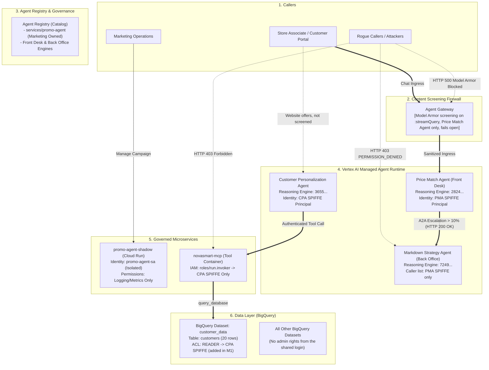

# Governing AI Agents · Build with Gemini Field Report

[](https://github.com/nelmiux/build-with-gemini/blob/main/LICENSE)
[](https://cloud.google.com)
[](https://nelmiux.github.io/build-with-gemini/)
[](https://github.com/nelmiux/build-with-gemini/actions/workflows/pages.yml)

This document constitutes a comprehensive field architecture report derived from Google Cloud's **Build with Gemini** workshop (Sunnyvale, California, September 25, 2026 — Track 2, *Platform Builders*). It details the architectural evolution of a fictional retail estate's AI agents from an ungoverned, highly vulnerable baseline to a fortified, zero-trust state. Critical controls—including explicit connectivity perimeters and inline semantic screening—were implemented and verified live. Notably, a customer-facing agent was subjected to rigorous screening protocols configured to fail open to ensure business continuity. While significant project-wide role assignments remain (detailed within the architectural limits), this report provides authoritative architectural guidelines applicable to production Gemini Enterprise deployments. It is designed to equip engineering and architecture teams who were not present at the workshop with actionable implementation standards.

> **Live site:** **[nelmiux.github.io/build-with-gemini](https://nelmiux.github.io/build-with-gemini/)** — Access the comprehensive report, featuring interactive before-and-after architecture state maps and a dedicated presentation mode (`#present`). · **[Documentation & Diagrams Viewer](https://nelmiux.github.io/build-with-gemini/docs.html)** — Explore detailed architectural blueprints and natively rendered Mermaid diagrams.

---


> [!IMPORTANT]
> **Start with the foundational report:** [nelmiux.github.io/build-with-gemini](https://nelmiux.github.io/build-with-gemini/) serves as the canonical system of record, containing the authoritative assessment, strategic recommendations, and executive presentation.
> - **[Architecture Evolution Report](docs/ARCHITECTURE_EVOLUTION_REPORT.md)**: Documents the system state progression from phase M0 through M2, supported by six structural Mermaid diagrams (phases M3 and M5 are recorded as independent modules).
> - The [Assessment & Recommendations](ASSESSMENT_AND_RECOMMENDATIONS.md) and [Executive Briefing](EXECUTIVE_SUMMARY.md) are preliminary drafts retained for historical context. The main report supersedes these documents, including revising the preliminary 10/10 rating and adoption mandate to reflect empirical lab measurements.

## 🌟 Executive Overview & Architectural Purpose

This repository catalogs the technical artifacts and architectural decisions from a hands-on technical lab focused on securing and governing **multi-agent AI systems** deployed on Google Cloud. It establishes a reference architecture for enterprise-grade AI governance.

Utilizing the fictional **NovaSmart** retail infrastructure as a baseline environment, this project documents the systematic fortification of managed agents (Vertex AI Reasoning Engines), dependent Cloud Run microservices, and BigQuery data access patterns. It tracks the architectural journey from a highly permeable initial state (M0) to a substantially secured state (M5), implementing zero-trust identity models and deploying Model Armor for inline semantic screening.

### Deliverables & Structural Components
- **The Core Report (`index.html`)**: A centralized reference document articulating the workshop's methodology to uninitiated stakeholders. It includes an interactive architectural progression tracking the five lab missions (Mission 4 was announced but technically omitted from the live lab). The document details baseline constraints (M0) through final implementation (M5), audit logs, rollback parameters, and an executive briefing presentation.
- **Documentation Viewer (`docs.html`)**: A client-side rendering engine that processes Markdown documentation, natively generating interactive Mermaid diagrams (enabling dynamic zoom, SVG export, and source inspection) and featuring integrated navigation and a table of contents.
- **Deep Technical Documentation (`docs/`)**: Rigorous architectural records covering M0 (Discovery), M1 (Identity/Data Posture), M2 (Inter-Agent IAM Perimeters), M3 (Model Armor Integration), and M5 (Evaluation Framework). It also includes a specialized architectural memo on semantic tool-call inspection, designated as M4 to bridge the lab's instructional gap.
- **Preliminary Drafts (`EXECUTIVE_SUMMARY.md`, `ASSESSMENT_AND_RECOMMENDATIONS.md`)**: Initial architectural assessments, maintained strictly for audit continuity.
- **Master Audit Ledger (`docs/AUDIT_LEDGER.md`)**: A definitive chronological ledger of the 12 architectural mutations executed during M1 and M2, complete with timestamps and validated rollback commands (excluding the M3 gateway attachment, which was excluded from the audit scope).

---

## 🏗️ Architecture Evolution (M0 → Target State)



---

## 🚀 Environment Initialization & Execution

The optimal method for exploring this reference architecture is via the hosted deployment at **<https://nelmiux.github.io/build-with-gemini/>** (application interface) and **<https://nelmiux.github.io/build-with-gemini/docs.html>** (technical documentation). Local execution methods are detailed below.

The report architecture relies on a standalone HTML construct, ensuring **zero build dependencies and no runtime overhead** beyond standard web typography.

### Option A: Direct Browser Access
Execute `index.html` natively in any modern browser runtime (Chrome, Edge, Firefox, Safari). Append `#present` to the URI string (or utilize the *Present* UI control) to initialize the presentation matrix.

> **Note:** The documentation viewer (`docs.html`) relies on asynchronous HTTP requests to retrieve Markdown assets. Consequently, local execution mandates a localized HTTP daemon (detailed below) to circumvent cross-origin file restrictions inherent to local file execution (`file://`).

### Option B: Node.js Web Server
```bash
# Clone the repository
git clone https://github.com/nelmiux/build-with-gemini.git
cd build-with-gemini

# Start the built-in HTTP server
npm start
# ➜ Running at http://localhost:8080
```

### Option C: Python 3 Web Server
```bash
python3 -m http.server 8080 --bind 127.0.0.1
# ➜ Running at http://localhost:8080
```

Both local server implementations strictly bind to the localhost interface. The `npm start` directive actively restricts access to hidden directories (e.g., `.git/`, `.envrc`). Override the host binding with `HOST=0.0.0.0` if network-wide exposure is explicitly required.

---

## 📚 Technical Documentation Directory

Review the architectural documentation via the **[documentation viewer](https://nelmiux.github.io/build-with-gemini/docs.html)** for live diagram rendering, or access the raw Markdown sources below (GitHub natively parses the Mermaid syntax).

| Architectural Module | Focus Area | Core Concepts |
|---|---|---|
| [**Executive Summary**](EXECUTIVE_SUMMARY.md) | Legacy Draft (Superseded) | Preliminary executive briefing; canonical truths reside in the master report. |
| [**M0: Discovery**](docs/M0_DISCOVERY.md) | Baseline & Posture Assessment | Shadow IT telemetry, identity conflation risks, and administrative over-provisioning. |
| [**M1: Identity & Data**](docs/M1_IDENTITY_DATA.md) | Decoupled Identity & Least Privilege | Agent Registry enforcement, isolated service accounts, SPIFFE attestation, BigQuery dataset-level ACLs. |
| [**M2: Inter-Agent IAM**](docs/M2_INTER_AGENT_IAM.md) | Micro-Segmentation & Tool Authorization | Vertex AI Reasoning Engine IAM enforcement, absolute 403 refusal matrices, Cloud Run access lockdown. |
| [**M3: Content Screening**](docs/M3_CONTENT_SCREENING.md) | Semantic Firewalls & Gateway Integration | Advanced prompt injection mitigation, backdoor neutralization, exposing the "project-wide floor fallacy." |
| [**M4: Semantic Governance**](docs/M4_SEMANTIC_GOVERNANCE.md) | Architectural Addendum | Deep-packet tool-call inspection and bulk data exfiltration defense mechanisms (bridging the lab's M4 gap). |
| [**M5: Evaluation**](docs/M5_EVALUATION_DECISION.md) | Evaluation Flywheel & Deployment Readiness | Gen AI Evaluation integration, deterministic LLM judging, scorecard generation, formal go-live protocols. |
| [**Master Audit Ledger**](docs/AUDIT_LEDGER.md) | Immutable Rollback & Audit Trail | Precise documentation of 12 M1–M2 infrastructure mutations, featuring execution timestamps and deterministic rollback commands. |

All architectural diagrams are strictly formulated in [Mermaid](https://mermaid.js.org/). Execute `npm run validate:diagrams` post-modification: this initiates a strict linting process via `mermaid-cli`, enforcing zero-tolerance for syntax anomalies (this CI gate secures all automated deployments). For localized IDE previewing within VS Code, deploy the *Markdown Preview Mermaid Support* extension.

---

## 🛠️ Verification & Simulation Automation

The `scripts/` directory houses critical automation and validation routines:
- `scripts/verify_estate.sh`: Executes rigorous diagnostic checks validating M1–M2 state mutations (catalog instantiation, service account isolation, Cloud Run invoker constraints, and BigQuery ACLs) utilizing `gcloud` and `bq` CLIs. It enforces strict exit codes upon verification failure. Given the ephemeral nature of the lab environment, execution against the original project will yield validation failures.
- `scripts/simulate_attacks.sh`: Deterministically outputs the HTTP response codes recorded during lab execution (HTTP 403 for unauthorized invocations, HTTP 200 for validated escalations, and HTTP 500 for Model Armor interventions) without initiating live network calls.
- `scripts/validate_diagrams.sh`: A strict diagram compilation pipeline utilizing `mermaid-cli` to detect parsing errors and halt build processes (`npm run validate:diagrams`).
- `scripts/build_site.sh`: Compiles the static architecture documentation for GitHub Pages deployment into the `_site/` directory (`npm run build`).

---

## ✍️ Editorial Workflow Integration

To facilitate non-technical editorial reviews, the documentation (the report, presentations, core documentation, and error pages) supports a bidirectional serialization process to standard word processors. Note: diagram labels, technical code blocks, CLI commands, deterministic outputs, and styled elements (e.g., diagram badges) are exempt from this workflow and require direct source modification.

1. **Serialization (Export).** Execute `npm run text:export`. This generates two untracked artifacts within `text-review/`: `report-text.docx` and `docs-text.docx`. These documents utilize a tabular structure mapping layout context (left column) to editable strings (right column). Both MS Word and Google Docs (via Suggesting mode) are fully supported.
2. **Review.** Reviewers modify the right-hand strings and return the updated `.docx` artifacts. Contextual comments are preserved during deserialization.
3. **Deserialization (Import).** Execute `npm run text:import -- path/to/the-file.docx` (append `--preview` for a dry run). The routine programmatically accepts tracked changes and maps the mutations back to the source Markdown. Protected elements (designated by `{1}`), product nomenclatures, inline code parameters, and URL paths are strictly preserved. The parser verifies structural integrity; if a mutation corrupts the markdown abstract syntax tree or fails an equivalence check, the specific change is aggressively reverted. Fatal document corruption (e.g., flattening the core table structure) halts the entire import sequence. A comprehensive diff report is generated within `text-review/`.
4. **Publication.** Validate the localized build via `npm start`, review the cryptographic diff via `git diff`, commit the validated state, and push to the remote repository.

Generate fresh export artifacts for iterative review cycles. Out-of-band source mutations occurring between export and import will safely invalidate corresponding edits, logging the conflict in the generated report. After updating source files directly, run `npm run text:check` to assert serialization stability. This pipeline requires a standard Python 3.9+ runtime environment.

---

## 🚢 Continuous Deployment (GitHub Pages)

Deployment automation is strictly governed by the [`Deploy site to GitHub Pages`](https://github.com/nelmiux/build-with-gemini/blob/main/.github/workflows/pages.yml) GitHub Actions workflow, triggered deterministically upon merge to the `main` branch:

1. **Validation Gate** — All Mermaid syntaxes are rigorously parsed. Syntax errors force an immediate build failure prior to artifact generation.
2. **Build Compilation** — `scripts/build_site.sh` orchestrates the compilation of `index.html`, `docs.html`, raw Markdown files, `LICENSE`, `404.html`, and the `.nojekyll` bypass directive into the `_site/` payload.
3. **Deployment Delivery** — The resultant artifact is securely distributed via the `actions/deploy-pages` mechanism to **<https://nelmiux.github.io/build-with-gemini/>**.

**Initial Infrastructure Provisioning:** Modifying the CI pipeline mandates authentication scopes permitting `workflow` execution (Classic PAT) or "Workflows: read and write" (Fine-Grained Token). The `push_to_github.sh` utility facilitates this provisioning. Additionally, repository administrators must manually initialize the GitHub Pages target, as the default ephemeral GITHUB_TOKEN lacks instantiation permissions. Navigate to **Settings → Pages → Build and deployment → Source: GitHub Actions** (or execute `gh api -X POST repos/nelmiux/build-with-gemini/pages -f build_type=workflow` as an administrator). Failure to initialize this component halts the pipeline at the pre-flight check. Once initialized, re-trigger the workflow. Zero external build tooling is required; the raw repository artifacts are deployed natively.

To execute a local deterministic preview of the deployment artifact:

```bash
npm run build                      # assembles _site/
python3 -m http.server 8080 --bind 127.0.0.1 -d _site
# ➜ http://localhost:8080  and  http://localhost:8080/docs.html
```

---

## 👤 Architectural Authorship & Acknowledgments

- **Lead Architect**: Nelma Perera ([GitHub](https://github.com/nelmiux))
- **Event Context**: Google Cloud *Build with Gemini*, Sunnyvale, California, September 25, 2026 (Track 2, Platform Builders)
- **Environment**: NovaSmart Control Center · Govern Your AI Estate (Track 2)
