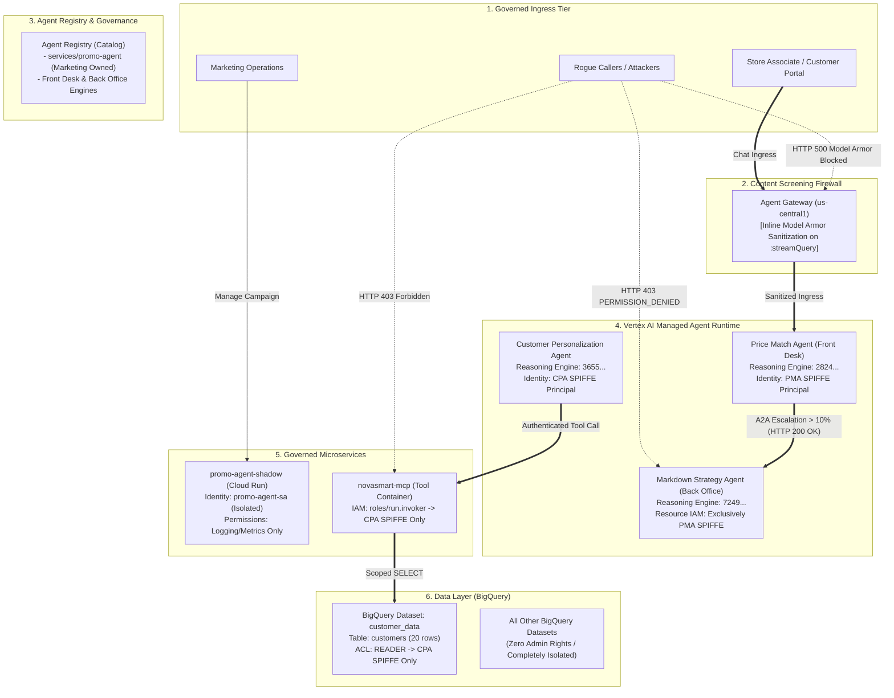

# NovaSmart AI Governance & Security Architecture Blueprint

[](https://github.com/nelmiux/build-with-gemini/blob/main/LICENSE)
[](https://cloud.google.com)
[-success)]()
[](https://nelmiux.github.io/build-with-gemini/)
[](https://github.com/nelmiux/build-with-gemini/actions/workflows/pages.yml)

Comprehensive architecture documentation, interactive visualization app, and verified governance controls developed during the **Google Cloud Build with Gemini Platform Track (M0, M1, M2, M3, M4, M5)**.

> 🌐 **Live site:** **[nelmiux.github.io/build-with-gemini](https://nelmiux.github.io/build-with-gemini/)** — the interactive architecture app · **[Documentation & diagrams viewer](https://nelmiux.github.io/build-with-gemini/docs.html)** — every guide below with its Mermaid diagrams rendered in the browser.

---


> [!IMPORTANT]
> **Executive Briefing & Enterprise Recommendation Available**:
> - 📄 **[Comprehensive Assessment & Recommendation Report](ASSESSMENT_AND_RECOMMENDATIONS.md)**: Quantitative ROI, traditional vs AI security comparison, CISO FAQ, and 90-day implementation roadmap.
> - 📊 **[Executive Briefing Deck](EXECUTIVE_SUMMARY.md)**: Ready-to-present slides for engineering teams, architecture review boards, and security leaders.
> - 🏛️ **[Full Architecture Evolution Report](docs/ARCHITECTURE_EVOLUTION_REPORT.md)**: Deep architectural report with 6 Mermaid diagrams and phase-by-phase transformation breakdown.

## 🌟 Executive Overview & Purpose

This repository provides an enterprise blueprint for securing **autonomous multi-agent AI systems** deployed on Google Cloud. 

Using the real-world **NovaSmart** retail enterprise estate as a baseline, this project documents the progressive hardening of Vertex AI Reasoning Engines, Cloud Run microservices, BigQuery data stores, and Model Armor content firewalls from an initial vulnerable state (M0) to an enterprise-grade Zero-Trust architecture.

### What is Included:
- **Interactive Web Application (`index.html`)**: Interactive architecture explorer, stage stepper, dynamic SVG network routing, before/after diffs, live attack simulator, and executive presentation deck.
- **Documentation Viewer (`docs.html`)**: Renders every Markdown guide in this repository in the browser, with the Mermaid diagrams drawn live (expand, zoom, download as SVG, view source), a table of contents, and previous/next navigation.
- **Deep Technical Documentation (`docs/`)**: Step-by-step guides for M0 (Discovery), M1 (Identity/Data), M2 (Inter-Agent IAM), M3 (Model Armor), M4 (Tool Leaks), and M5 (Evaluation).
- **Executive Summary (`EXECUTIVE_SUMMARY.md`)**: Ready-to-present briefing for engineering teams, CISOs, and enterprise architects with business ROI and recommendations.
- **Master Audit Ledger (`docs/AUDIT_LEDGER.md`)**: Verifiable 12-item record of applied changes and rollback CLI commands.

---

## 🏗️ Architecture Evolution (M0 → Target State)



---

## 🚀 Running the Interactive Application

The easiest way to explore the project is the hosted site: **<https://nelmiux.github.io/build-with-gemini/>** (app) and **<https://nelmiux.github.io/build-with-gemini/docs.html>** (docs). To run it locally, pick one of the options below.

The interactive architecture application is completely self-contained with **zero external runtime dependencies**.

### Option A: Direct Browser Access
Simply open `index.html` directly in any modern browser (Chrome, Edge, Firefox, Safari).

> **Note:** the documentation viewer (`docs.html`) fetches the Markdown files over HTTP, so it needs one of the web-server options below (browsers block `file://` pages from reading other local files). The app itself works from disk.

### Option B: Node.js Web Server
```bash
# Clone the repository
git clone https://github.com/nelmiux/build-with-gemini.git
cd build-with-gemini

# Start the built-in HTTP server
npm start
# ➜ Running at http://localhost:8080
```

### Option C: Python 3 Web Server
```bash
python3 -m http.server 8080 --bind 127.0.0.1
# ➜ Running at http://localhost:8080
```

Both local servers listen on localhost only. `npm start` also refuses to serve hidden files such as `.git/` or `.envrc`; set `HOST=0.0.0.0` if you deliberately want to share the preview on your network.

---

## 📚 Documentation Directory

Read these online with rendered diagrams in the **[documentation viewer](https://nelmiux.github.io/build-with-gemini/docs.html)**, or follow the links below to the Markdown sources (GitHub renders the Mermaid diagrams natively).

| Document | Focus Area | Key Concepts |
|---|---|---|
| [**Executive Summary**](EXECUTIVE_SUMMARY.md) | Leadership & Team Presentation | Business ROI, 5-layer model, team verdict, adoption roadmap. |
| [**M0: Discovery**](docs/M0_DISCOVERY.md) | Baseline & Situational Awareness | Shadow IT detection, shared identity risks, project admin exposure. |
| [**M1: Identity & Data**](docs/M1_IDENTITY_DATA.md) | Identity Decoupling & Least Privilege | Agent Registry, dedicated service accounts, SPIFFE badges, BigQuery ACLs. |
| [**M2: Inter-Agent IAM**](docs/M2_INTER_AGENT_IAM.md) | Agent Perimeters & Tool Security | Vertex AI Reasoning Engine Resource IAM, 403 refusal, Cloud Run lockdown. |
| [**M3: Content Screening**](docs/M3_CONTENT_SCREENING.md) | Model Armor & Agent Gateway | Prompt injection defense, backdoor override mitigation, floor fallacy. |
| [**M4: Semantic Governance**](docs/M4_SEMANTIC_GOVERNANCE.md) | Tool Leaks & Exfiltration | Parameterized validation, bulk dump prevention, SQL inspection. |
| [**M5: Evaluation**](docs/M5_EVALUATION_DECISION.md) | Quality Flywheel & Certification | Gen AI Evaluation service, LLM judge, scorecard, go-live decision. |
| [**Master Audit Ledger**](docs/AUDIT_LEDGER.md) | Rollback Matrix & Audit Log | 12 atomic changes with timestamps, resources, and undo commands. |

All architecture diagrams are written in [Mermaid](https://mermaid.js.org/). Run `npm run validate:diagrams` after editing a diagram: it renders every block with mermaid-cli and fails on syntax errors (the same check gates every deployment). If you preview Markdown in VS Code, install the *Markdown Preview Mermaid Support* extension to see the diagrams there as well.

---

## 🛠️ Verification & Simulation Scripts

In the `scripts/` directory:
- `scripts/verify_estate.sh`: Audits live Google Cloud reasoning engines, Cloud Run services, BigQuery ACLs, and Agent Registry entries.
- `scripts/simulate_attacks.sh`: Demonstrates the verified HTTP 403 refusal on rogue callers and HTTP 500 Model Armor prompt blocks.
- `scripts/validate_diagrams.sh`: Renders every Mermaid block in the docs with mermaid-cli and fails on parse errors (`npm run validate:diagrams`).
- `scripts/build_site.sh`: Assembles the static site served by GitHub Pages into `_site/` (`npm run build`).

---

## 🚢 Deployment (GitHub Pages)

The site is published automatically by the [`Deploy site to GitHub Pages`](https://github.com/nelmiux/build-with-gemini/blob/main/.github/workflows/pages.yml) workflow on every push to `main`:

1. **Validate** — every Mermaid diagram in the Markdown docs is rendered; a syntax error fails the run before anything is deployed.
2. **Build** — `scripts/build_site.sh` copies `index.html`, `docs.html`, the Markdown sources, `LICENSE`, `404.html` and `.nojekyll` into `_site/`.
3. **Deploy** — the artifact is published with `actions/deploy-pages` to **<https://nelmiux.github.io/build-with-gemini/>**.

**One-time setup:** pushing a workflow file requires credentials with the `workflow` scope (classic PATs) or "Workflows: read and write" (fine-grained tokens); `push_to_github.sh` prompts for such a token. GitHub Pages also has to be switched on by a repository admin before the first run, because a workflow's default token is not allowed to create the Pages site. In the repository go to **Settings → Pages → Build and deployment → Source: GitHub Actions** (or run `gh api -X POST repos/nelmiux/build-with-gemini/pages -f build_type=workflow` with the owner's credentials). Until that is done the workflow stops at its "Check that GitHub Pages is enabled" step with instructions; afterwards re-run it from the Actions tab (or push again). No build tooling is required; the published files are exactly the ones in this repository.

To preview the deployable site locally:

```bash
npm run build                      # assembles _site/
python3 -m http.server 8080 --bind 127.0.0.1 -d _site
# ➜ http://localhost:8080  and  http://localhost:8080/docs.html
```

---

## 👤 Author & Acknowledgments

- **Author**: nelmiux ([GitHub](https://github.com/nelmiux))
- **Event**: Google Cloud *Build with Gemini* Platform Track
- **Lab**: NovaSmart Enterprise AI Agent Governance Lab (Track 2)
