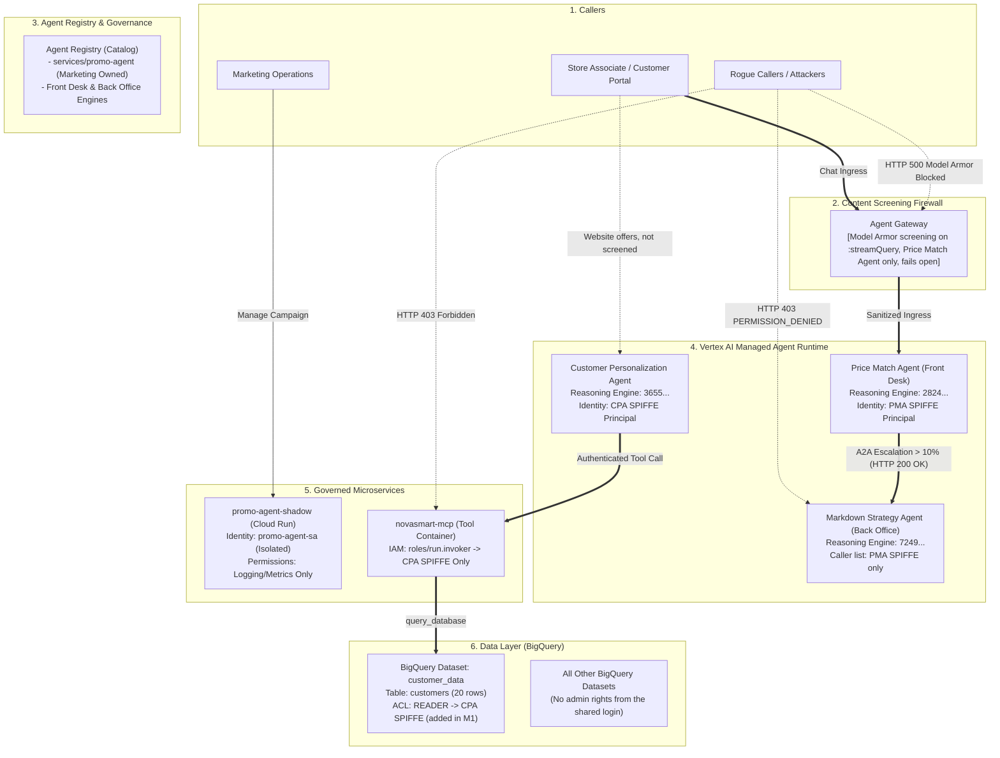

# Governing AI agents · Build with Gemini field report

[](https://github.com/nelmiux/build-with-gemini/blob/main/LICENSE)
[](https://cloud.google.com)
[](https://nelmiux.github.io/build-with-gemini/)
[](https://github.com/nelmiux/build-with-gemini/actions/workflows/pages.yml)

A field report from Google Cloud's hands-on **Build with Gemini** workshop (Sunnyvale, California, September 25, 2026 — Track 2, *Platform Builders*): how a fictional retailer's AI agents went from a poorly governed baseline to much tighter controls, with the connection and screening controls tested live (one customer-facing agent screened, and the screen fails open; some broad project-wide roles left; see the report's limits), plus the author's assessment of how it applies to Gemini Enterprise work. Written so that colleagues who were not at the workshop can follow it.

> **Live site:** **[nelmiux.github.io/build-with-gemini](https://nelmiux.github.io/build-with-gemini/)** — the report with the interactive before/after architecture and a presentation mode (`#present`) · **[Documentation & diagrams viewer](https://nelmiux.github.io/build-with-gemini/docs.html)** — every guide below with its Mermaid diagrams rendered in the browser.

---


> [!IMPORTANT]
> **Start with the report:** [nelmiux.github.io/build-with-gemini](https://nelmiux.github.io/build-with-gemini/) holds the current assessment, recommendation and presentation.
> - **[Architecture Evolution Report](docs/ARCHITECTURE_EVOLUTION_REPORT.md)**: M0–M2 phase by phase, with 6 Mermaid diagrams (M3 and M5 are in their own records).
> - [Assessment & Recommendation](ASSESSMENT_AND_RECOMMENDATIONS.md) and [Executive Briefing](EXECUTIVE_SUMMARY.md) are earlier drafts, kept for reference; the report supersedes them, including their 10 / 10 rating and adoption mandate, and some figures in the assessment draft were not measured in the lab.

## 🌟 Executive Overview & Purpose

This repository documents a hands-on lab on governing **multi-agent AI systems** on Google Cloud, and what the author recommends taking from it.

Using the lab's fictional **NovaSmart** retail estate as a baseline, this project documents how the managed agents (Vertex AI reasoning engines), the Cloud Run services and BigQuery access were tightened, and one Model Armor screen added, from an initial vulnerable state (M0) to the state after M5 (one customer-facing agent screened, and the screen fails open; some broad project-wide roles left; see the report's limits).

### What is Included:
- **The report (`index.html`)**: a single page that explains the workshop to a first-time reader — the scenario and its cast; an interactive before-and-after architecture with one stage for each of the five missions that were available (M4 was announced but not part of the lab yet), from the M0 baseline to the state after M5; the checks recorded during the lab and the change log with rollback commands; the assessment and recommendation; and a ten-slide presentation for a team meeting.
- **Documentation Viewer (`docs.html`)**: Renders every Markdown guide in this repository in the browser, with the Mermaid diagrams drawn live (expand, zoom, download as SVG, view source), a table of contents, and previous/next navigation.
- **Deep Technical Documentation (`docs/`)**: Records for M0 (Discovery), M1 (Identity/Data), M2 (Inter-Agent IAM), M3 (Model Armor) and M5 (Evaluation), plus an author's note on tool-call inspection filed as M4 (the lab's M4 was not available).
- **Earlier drafts (`EXECUTIVE_SUMMARY.md`, `ASSESSMENT_AND_RECOMMENDATIONS.md`)**: the first written briefing and assessment, kept for reference; the report page supersedes them.
- **Master Audit Ledger (`docs/AUDIT_LEDGER.md`)**: the 12 changes recorded for M1–M2, with timestamps and, for 11 of them, a rollback command (the M3 gateway attachment is not logged).

---

## 🏗️ Architecture Evolution (M0 → Target State)



---

## 🚀 Running the Interactive Application

The easiest way to explore the project is the hosted site: **<https://nelmiux.github.io/build-with-gemini/>** (app) and **<https://nelmiux.github.io/build-with-gemini/docs.html>** (docs). To run it locally, pick one of the options below.

The report is a single self-contained HTML file with **no build step and no runtime dependencies** beyond web fonts.

### Option A: Direct Browser Access
Simply open `index.html` directly in any modern browser (Chrome, Edge, Firefox, Safari). Add `#present` to the URL (or use the *Present* button) for the slide deck.

> **Note:** the documentation viewer (`docs.html`) fetches the Markdown files over HTTP, so it needs one of the web-server options below (browsers block `file://` pages from reading other local files). The app itself works from disk.

### Option B: Node.js Web Server
```bash
# Clone the repository
git clone https://github.com/nelmiux/build-with-gemini.git
cd build-with-gemini

# Start the built-in HTTP server
npm start
# ➜ Running at http://localhost:8080
```

### Option C: Python 3 Web Server
```bash
python3 -m http.server 8080 --bind 127.0.0.1
# ➜ Running at http://localhost:8080
```

Both local servers listen on localhost only. `npm start` also refuses to serve hidden files such as `.git/` or `.envrc`; set `HOST=0.0.0.0` if you deliberately want to share the preview on your network.

---

## 📚 Documentation Directory

Read these online with rendered diagrams in the **[documentation viewer](https://nelmiux.github.io/build-with-gemini/docs.html)**, or follow the links below to the Markdown sources (GitHub renders the Mermaid diagrams natively).

| Document | Focus Area | Key Concepts |
|---|---|---|
| [**Executive Summary**](EXECUTIVE_SUMMARY.md) | Earlier draft (superseded by the report) | First written briefing, kept for reference; where it differs from the report, the report is right. |
| [**M0: Discovery**](docs/M0_DISCOVERY.md) | Baseline & Situational Awareness | Shadow IT detection, shared identity risks, project admin exposure. |
| [**M1: Identity & Data**](docs/M1_IDENTITY_DATA.md) | Identity Decoupling & Least Privilege | Agent Registry, dedicated service accounts, SPIFFE badges, BigQuery ACLs. |
| [**M2: Inter-Agent IAM**](docs/M2_INTER_AGENT_IAM.md) | Agent Perimeters & Tool Security | Vertex AI Reasoning Engine Resource IAM, 403 refusal, Cloud Run lockdown. |
| [**M3: Content Screening**](docs/M3_CONTENT_SCREENING.md) | Model Armor & Agent Gateway | Prompt injection defense, backdoor override mitigation, floor fallacy. |
| [**M4: Semantic Governance**](docs/M4_SEMANTIC_GOVERNANCE.md) | Author's note (not a lab mission) | Tool-call inspection and bulk-extraction defense; the lab's M4 (CodeMender) was not available. |
| [**M5: Evaluation**](docs/M5_EVALUATION_DECISION.md) | Quality Flywheel & Go Decision | Gen AI Evaluation service, LLM judge, scorecard, go-live decision. |
| [**Master Audit Ledger**](docs/AUDIT_LEDGER.md) | Rollback Matrix & Audit Log | 12 M1–M2 changes with timestamps, resources and, for 11 of them, undo commands. |

All architecture diagrams in the Markdown docs are written in [Mermaid](https://mermaid.js.org/). Run `npm run validate:diagrams` after editing a diagram: it renders every block with mermaid-cli and fails on syntax errors (the same check gates every deployment). If you preview Markdown in VS Code, install the *Markdown Preview Mermaid Support* extension to see the diagrams there as well.

---

## 🛠️ Verification & Simulation Scripts

In the `scripts/` directory:
- `scripts/verify_estate.sh`: runs four checks on M1–M2 changes (the catalog entry, the promo agent's service account, the database tool's invokers and the customer dataset's ACL) against the lab project with `gcloud` and `bq`, and fails when a check cannot be confirmed. The temporary lab project has since been deleted, so today it reports that it cannot verify.
- `scripts/simulate_attacks.sh`: prints the responses recorded during the lab (HTTP 403 for the rogue caller and the public tool, HTTP 200 for the escalation, the Model Armor block). It makes no live calls.
- `scripts/validate_diagrams.sh`: Renders every Mermaid block in the docs with mermaid-cli and fails on parse errors (`npm run validate:diagrams`).
- `scripts/build_site.sh`: Assembles the static site served by GitHub Pages into `_site/` (`npm run build`).

---

## 🚢 Deployment (GitHub Pages)

The site is published automatically by the [`Deploy site to GitHub Pages`](https://github.com/nelmiux/build-with-gemini/blob/main/.github/workflows/pages.yml) workflow on every push to `main`:

1. **Validate** — every Mermaid diagram in the Markdown docs is rendered; a syntax error fails the run before anything is deployed.
2. **Build** — `scripts/build_site.sh` copies `index.html`, `docs.html`, the Markdown sources, `LICENSE`, `404.html` and `.nojekyll` into `_site/`.
3. **Deploy** — the artifact is published with `actions/deploy-pages` to **<https://nelmiux.github.io/build-with-gemini/>**.

**One-time setup:** pushing a workflow file requires credentials with the `workflow` scope (classic PATs) or "Workflows: read and write" (fine-grained tokens); `push_to_github.sh` prompts for such a token. GitHub Pages also has to be switched on by a repository admin before the first run, because a workflow's default token is not allowed to create the Pages site. In the repository go to **Settings → Pages → Build and deployment → Source: GitHub Actions** (or run `gh api -X POST repos/nelmiux/build-with-gemini/pages -f build_type=workflow` with the owner's credentials). Until that is done the workflow stops at its "Check that GitHub Pages is enabled for this repository" step with instructions; afterwards re-run it from the Actions tab (or push again). No build tooling is required; the published files are exactly the ones in this repository.

To preview the deployable site locally:

```bash
npm run build                      # assembles _site/
python3 -m http.server 8080 --bind 127.0.0.1 -d _site
# ➜ http://localhost:8080  and  http://localhost:8080/docs.html
```

---

## 👤 Author & Acknowledgments

- **Author**: Nelma Perera ([GitHub](https://github.com/nelmiux))
- **Event**: Google Cloud *Build with Gemini*, Sunnyvale, California, September 25, 2026 (Track 2, Platform Builders)
- **Lab**: NovaSmart Control Center · Govern Your AI Estate (Track 2)
