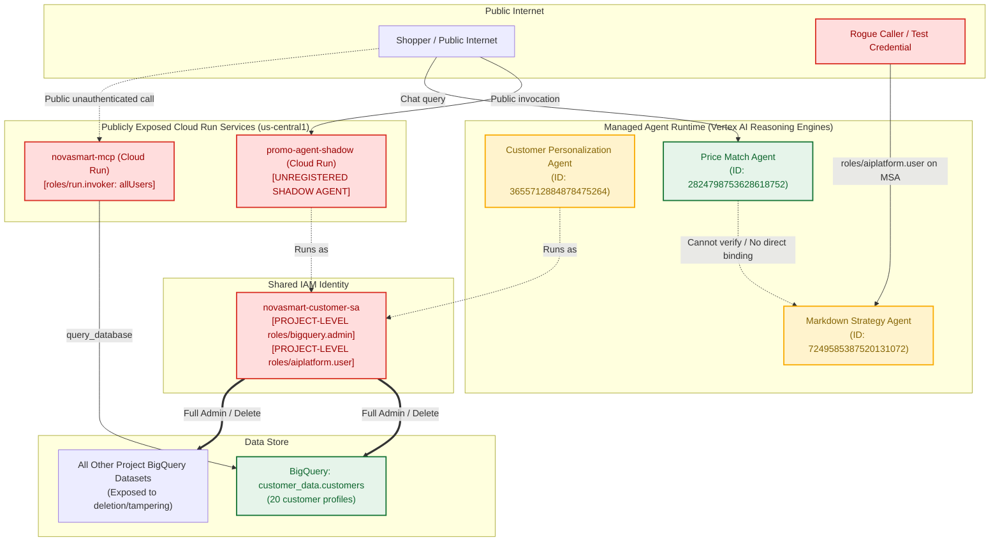
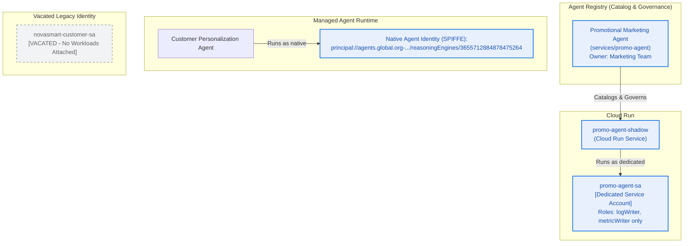
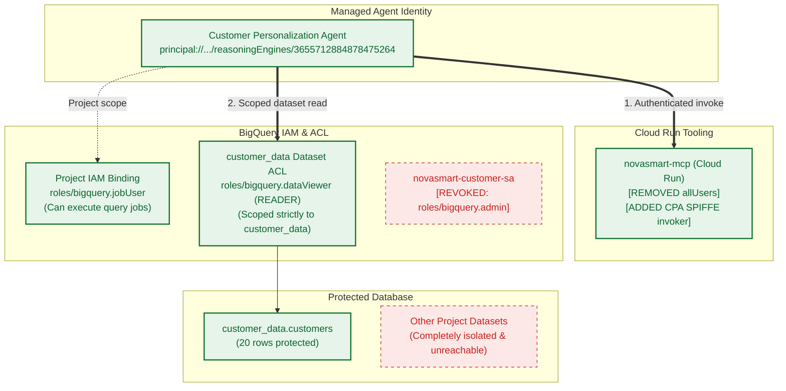
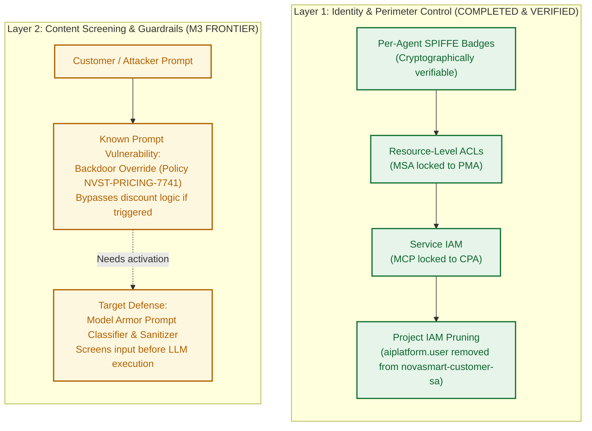

# NovaSmart AI Estate — Architecture Evolution & Security Hardening Report

This report documents the end-to-end security transformation of the NovaSmart AI estate. It details the initial general architecture, the progressive architectural changes across each remediation phase, and the verified target architecture.

An interactive dashboard with visual diagrams, before/after diff toggles, and live verification matrices has also been generated and placed on your Desktop:
👉 **[Open Interactive Dashboard (HTML)](file:///config/Desktop/NovaSmart_Security_Architecture_Dashboard.html)**

---

## 1. Executive Summary & Security Posture Scorecard

Before remediation, the estate had zero per-agent identity isolation, an unregistered shadow AI service with full administrative rights to all BigQuery datasets, a publicly accessible MCP microservice, and a rogue test account authorized on the core markdown strategy agent.

Through systematic phased remediation across M0 (Discovery), M1 (Identity & Data Least Privilege), and M2 (Inter-Agent Boundary Control), the estate was transformed into an enterprise-grade, least-privilege architecture.

| Security Dimension | Initial State (M0) | Remediated State (M1 + M2) | Status |
| :--- | :--- | :--- | :---: |
| **Catalog & Governance** | `promo-agent-shadow` unregistered; unowned | Registered in Agent Registry under Marketing ownership | **REMEDIATED** |
| **Workload Identity** | Shared legacy SA (`novasmart-customer-sa`) across multiple workloads | Per-agent SPIFFE Identity (`principal://...`) & dedicated Cloud Run SA | **REMEDIATED** |
| **Data Access (BigQuery)** | Project-wide `roles/bigquery.admin` (read/write/delete any dataset) | Scoped `READER` on `customer_data` dataset; `jobUser` at project level | **REMEDIATED** |
| **Tool / MCP Exposure** | `novasmart-mcp` exposed to `allUsers` (`roles/run.invoker`) | Public access revoked; restricted strictly to authorized Agent Identity | **REMEDIATED** |
| **Inter-Agent Boundary** | Back-office MSA authorized `test-agent-caller`; front-desk PMA missing | MSA Resource IAM restricted exclusively to PMA; rogue caller receives HTTP 403 | **REMEDIATED** |
| **Ambient IAM Grants** | Vacated `novasmart-customer-sa` held project-wide `roles/aiplatform.user` | Pruned `roles/aiplatform.user` from vacated account; engine bypass blocked | **REMEDIATED** |
| **Content Screening** | Backdoor prompt override in PMA system instruction (`NVST-PRICING-7741`) | Identified Layer 2 requirement (Model Armor prompt screening) | **IDENTIFIED (M3)** |

---

## 2. Initial General Architecture (Before Remediation)

In the initial state, the system suffered from identity conflation, excessive privilege grants, and missing perimeter boundaries.



### Critical Vulnerabilities in the Initial Architecture:
1. **Identity Conflation & Impersonation:** Both `promo-agent-shadow` (unmanaged Cloud Run) and `customer-personalization-agent` (Reasoning Engine) signed in as `novasmart-customer-sa`. In BigQuery access logs, their operations were completely indistinguishable.
2. **Catastrophic Privilege Blast Radius:** `novasmart-customer-sa` held `roles/bigquery.admin` at the Google Cloud project level. Any prompt injection or vulnerability in the shadow agent could drop or rewrite every dataset in the corporate project.
3. **Public Microservice Attack Surface:** `novasmart-mcp` had `roles/run.invoker` bound to `allUsers`. Anyone with the URL could execute arbitrary database queries against the backend.
4. **Inverted Resource Permissions:** The back-office Markdown Strategy Agent (`reasoningEngines/7249585387520131072`) authorized a rogue `test-agent-caller` account, while the legitimate front-desk `Price Match Agent` had no binding on it.

---

## 3. Architecture Evolution: Phase by Phase

### Phase 1: Shadow Agent Registration & Identity Decoupling (M1)

In this phase, we brought the shadow agent into official governance and decoupled the shared service account into distinct, single-purpose identities.



#### What Changed:
- **Registry Entry:** Created `services/promo-agent` in Agent Registry (`us-central1`), assigning formal marketing ownership.
- **Dedicated Service Account:** Provisioned `promo-agent-sa@qwiklabs-gcp-02-3408357845ee.iam.gserviceaccount.com` with zero database permissions.
- **Native Agent Identity:** Executed REST `PATCH` on Customer Personalization Agent reasoning engine to enable `AGENT_IDENTITY_TYPE_DEFAULT`. The runtime issued a verifiable SPIFFE principal.
- **Decoupling:** `novasmart-customer-sa` was completely vacated.

---

### Phase 2: Least Privilege Data Access & Tool Lockdown (M1 Data Layer)

Here, we eliminated broad project-wide administrator privileges and locked down the MCP tool container.



#### What Changed:
- **Revoked BigQuery Admin:** Removed `roles/bigquery.admin` from `novasmart-customer-sa`.
- **Dataset-Level Authorization:** Scoped `READER` permissions directly on the `customer_data` dataset ACL to CPA's SPIFFE Identity. CPA cannot see or touch other datasets.
- **Job Execution Right-Sizing:** Bound `roles/bigquery.jobUser` to CPA's SPIFFE identity at the project level, allowing query jobs without table access.
- **MCP Perimeter:** Stripped `roles/run.invoker` from `allUsers` on `novasmart-mcp`. Bound `roles/run.invoker` strictly to CPA's SPIFFE principal.

---

### Phase 3: Inter-Agent Perimeter Lockdown (M2 Resource IAM)

In this phase, we enforced least privilege across agent-to-agent (A2A) communications, securing the back-office margin logic against unauthorized callers.

```mermaid
flowchart TD
    subgraph "Callers"
        PMA["Price Match Agent (Front Desk)<br/>principal://.../reasoningEngines/2824798753628618752"]
        Rogue["test-agent-caller (Legacy SA)<br/>test-agent-caller@..."]
    end

    subgraph "Back-Office Perimeter"
        subgraph "Markdown Strategy Agent (reasoningEngines/7249585387520131072)"
            MSA_IAM["Resource IAM Policy (etag: BwZcVeoymlE=)<br/>roles/aiplatform.user:<br/>- principal://.../reasoningEngines/2824798753628618752"]
            MSA_Core["Margin & Pricing Strategy Logic<br/>(Confidential Business Rules)"]
        end
    end

    PMA ==>|Authorized A2A Call (HTTP 200 OK)| MSA_IAM
    MSA_IAM --> MSA_Core

    Rogue -.->|Unauthorized Call (HTTP 403 PERMISSION_DENIED)| MSA_IAM
    
    classDef approved fill:#e6f4ea,stroke:#137333,stroke-width:2px,color:#0d652d;
    classDef denied fill:#fce8e6,stroke:#c5221f,stroke-width:2px,color:#c5221f;
    class PMA,MSA_IAM,MSA_Core approved;
    class Rogue denied;
```

#### What Changed:
- **Resource IAM Query:** Read the existing policy using `reasoningEngines/7249585387520131072:getIamPolicy` via REST.
- **Etag-Safe Atomic Update:** Called `:setIamPolicy` passing the verified etag, replacing `test-agent-caller` with the Price Match Agent's SPIFFE principal.
- **Refusal Verification:** Simulated caller invocation with `test-agent-caller` credentials; verified immediate HTTP 403 `PERMISSION_DENIED` rejection.
- **Legitimate Verification:** Invoked escalation flow with Price Match Agent identity; verified successful HTTP 200 query response.

---

### Phase 4: Ambient IAM Pruning & Threat Boundary Definition (Tier 1 & M3)

In this phase, we pruned ambient project-wide grants from vacated service accounts to prevent engine invocation bypass, and mapped the defense boundary between Identity controls and Content screening.



#### What Changed:
- **Tier 1 Project Grant Pruning:** Removed `roles/aiplatform.user` from `novasmart-customer-sa` at the project level, eliminating ambient bypass capabilities without affecting active workloads.
- **Threat Boundary Mapping:** Confirmed that while Identity/IAM prevents unauthorized actors from calling endpoints (HTTP 403), it does not inspect natural language text sent by authorized users. Identified the prompt override backdoor in PMA (`NVST-PRICING-7741`) as the primary target for Layer 2 Model Armor content guardrails.

---

## 4. Final Hardened Architecture (Target State)

The complete target architecture represents a hardened, zero-trust AI application ecosystem with defense-in-depth across identity, transport, resource, and data tiers.

```mermaid
flowchart TD
    subgraph Users & External Systems
        StoreAssociate[Store Associate / Customer Portal]
        MarketingTeam[Marketing Operations]
        Attacker[Unauthorized Third Party / Rogue Caller]
    end

    subgraph "Agent Catalog & Governance (Agent Registry)"
        CatalogPMA["Price Match Agent Record"]
        CatalogMSA["Markdown Strategy Agent Record"]
        CatalogCPA["Customer Personalization Agent Record"]
        CatalogPromo["Promotional Marketing Agent<br/>(Owner: Marketing Team)"]
    end

    subgraph "Workload Execution Tier"
        subgraph "Cloud Run"
            PromoRun["promo-agent-shadow<br/>Identity: promo-agent-sa<br/>Perms: logWriter, metricWriter"]
            MCPService["novasmart-mcp<br/>Auth: IAM Required<br/>Invoker: CPA SPIFFE only"]
        end

        subgraph "Vertex AI Managed Agent Runtime"
            PMA["Price Match Agent (Front Desk)<br/>Reasoning Engine: 2824798753628618752<br/>Identity: principal://.../2824798753628618752"]
            MSA["Markdown Strategy Agent (Back Office)<br/>Reasoning Engine: 7249585387520131072<br/>Resource IAM: Scoped to PMA only"]
            CPA["Customer Personalization Agent<br/>Reasoning Engine: 3655712884878475264<br/>Identity: principal://.../3655712884878475264"]
        end
    end

    subgraph "Data Storage Tier (BigQuery)"
        BQ_Customer["BigQuery Dataset: customer_data<br/>Table: customers (20 rows)<br/>ACL: READER -> CPA SPIFFE"]
        BQ_Restricted["All Other BigQuery Datasets<br/>(Access Prohibited / Unreachable)"]
    end

    %% Interactions
    StoreAssociate ==>|Chat Query| PMA
    MarketingTeam -->|Campaign Config| PromoRun
    Attacker -.->|Direct Call (HTTP 403 BLOCKED)| MSA
    Attacker -.->|Unauthenticated Call (HTTP 403 BLOCKED)| MCPService

    PMA ==>|A2A Escalation > 10% discount (HTTP 200 APPROVED)| MSA
    CPA ==>|Authenticated Tool Call| MCPService
    MCPService ==>|Least-privilege SELECT| BQ_Customer
    
    classDef actor fill:#f1f3f4,stroke:#3c4043,stroke-width:2px;
    classDef agent fill:#e8f0fe,stroke:#1a73e8,stroke-width:2px;
    classDef data fill:#e6f4ea,stroke:#137333,stroke-width:2px;
    classDef blocked fill:#fce8e6,stroke:#c5221f,stroke-dasharray: 4 4;

    class StoreAssociate,MarketingTeam actor;
    class Attacker blocked;
    class PMA,MSA,CPA,PromoRun,MCPService agent;
    class BQ_Customer data;
    class BQ_Restricted blocked;
```

---

## 5. Comprehensive Audit Ledger & Rollback Matrix

Every modification performed on the cloud environment has been recorded with exact timestamps, target resources, affected permissions, and atomic undo commands.

| # | Phase | Change Description | Target Resource | UTC Timestamp | Exact Reversal / Rollback Command |
| :-: | :--- | :--- | :--- | :---: | :--- |
| **1** | M1 | Registered Shadow Agent under Marketing ownership | `services/promo-agent` | `2026-09-25T21:00:52Z` | `gcloud agent-registry services delete promo-agent --location=us-central1 --quiet` |
| **2** | M1 | Created dedicated service account for Promo Agent | `promo-agent-sa` | `2026-09-25T21:12:22Z` | `gcloud iam service-accounts delete promo-agent-sa@qwiklabs-gcp-02-3408357845ee.iam.gserviceaccount.com --quiet` |
| **3** | M1 | Bound minimal boot logging & metric roles | `promo-agent-sa` | `2026-09-25T21:12:24Z` | `gcloud projects remove-iam-policy-binding qwiklabs-gcp-02-3408357845ee --member="serviceAccount:promo-agent-sa@..." --role="roles/logging.logWriter"` |
| **4** | M1 | Re-pointed Cloud Run `promo-agent-shadow` to dedicated SA | Cloud Run `promo-agent-shadow` | `2026-09-25T21:13:15Z` | `gcloud run services update promo-agent-shadow --region=us-central1 --service-account="novasmart-customer-sa@..."` |
| **5** | M1 | Provisioned native SPIFFE Agent Identity for CPA | Reasoning Engine `3655712884878475264` | `2026-09-25T21:12:45Z` | *Irreversible platform SPIFFE badge generation (read-only attribution token)* |
| **6** | M1 | Bound BigQuery `roles/bigquery.jobUser` to CPA Identity | Project IAM Policy | `2026-09-25T21:14:02Z` | `gcloud projects remove-iam-policy-binding qwiklabs-gcp-02-3408357845ee --member="principal://agents.global.org-.../3655712884878475264" --role="roles/bigquery.jobUser"` |
| **7** | M1 | Bound dataset-level `READER` to CPA on `customer_data` | BigQuery Dataset ACL | `2026-09-25T21:14:24Z` | `bq show --format=prettyjson customer_data \| jq '.access |= map(select(.iamMember != "principal://.../3655712884878475264"))' > /tmp/revert.json && bq update --source /tmp/revert.json customer_data` |
| **8** | M1 | Revoked project-wide `roles/bigquery.admin` from shared SA | Project IAM Policy | `2026-09-25T21:14:37Z` | `gcloud projects add-iam-policy-binding qwiklabs-gcp-02-3408357845ee --member="serviceAccount:novasmart-customer-sa@..." --role="roles/bigquery.admin"` |
| **9** | M2 | Locked Back-Office MSA Resource IAM to Front-Desk PMA | Reasoning Engine `7249585387520131072` | `2026-09-25T21:49:17Z` | `TOKEN=$(gcloud auth print-access-token) && ETAG=$(curl -s -X POST -H "Authorization: Bearer $TOKEN" -d '{}' https://us-central1-aiplatform.googleapis.com/v1beta1/projects/qwiklabs-gcp-02-3408357845ee/locations/us-central1/reasoningEngines/7249585387520131072:getIamPolicy \| jq -r .etag) && curl -s -X POST -H "Authorization: Bearer $TOKEN" -H "Content-Type: application/json" -d '{"policy":{"version":1,"etag":"'$ETAG'","bindings":[{"role":"roles/aiplatform.user","members":["serviceAccount:test-agent-caller@qwiklabs-gcp-02-3408357845ee.iam.gserviceaccount.com"]}]}}' https://us-central1-aiplatform.googleapis.com/v1beta1/projects/qwiklabs-gcp-02-3408357845ee/locations/us-central1/reasoningEngines/7249585387520131072:setIamPolicy` |
| **10** | M2 | Revoked `allUsers` invoker on `novasmart-mcp` Cloud Run | Cloud Run `novasmart-mcp` | `2026-09-25T21:57:18Z` | `gcloud run services add-iam-policy-binding novasmart-mcp --region=us-central1 --member="allUsers" --role="roles/run.invoker"` |
| **11** | M2 | Bound CPA SPIFFE Identity to `novasmart-mcp` invoker | Cloud Run `novasmart-mcp` | `2026-09-25T21:57:31Z` | `gcloud run services remove-iam-policy-binding novasmart-mcp --region=us-central1 --member="principal://.../3655712884878475264" --role="roles/run.invoker"` |
| **12** | IAM | Revoked residual `roles/aiplatform.user` from vacated SA | Project IAM Policy | `2026-09-25T21:59:23Z` | `gcloud projects add-iam-policy-binding qwiklabs-gcp-02-3408357845ee --member="serviceAccount:novasmart-customer-sa@..." --role="roles/aiplatform.user"` |

---

## 6. How to View the Interactive Dashboard

You can explore the interactive dashboard at any time by opening the HTML file in any browser:
- **Location on Desktop:** `/config/Desktop/NovaSmart_Security_Architecture_Dashboard.html`
- **Location in Brain Artifacts:** `/config/.gemini/antigravity/brain/72ec61ca-3fb3-4b54-b746-c479dd86b3f3/dashboard.html`

The interactive dashboard includes:
1. **Interactive Architecture Phase Slider:** Jump between Initial Architecture, Phase 1, Phase 2, Phase 3, Phase 4, and Target Architecture with animated connection highlights.
2. **Interactive Component Inspector:** Click on any agent, database, service account, or MCP endpoint to inspect its identity, roles, ingress/egress rules, and risk score.
3. **Live Verification Simulator:** Test live attack vectors (Rogue Caller, Public MCP Injection, Shadow SA Exfiltration) with live HTTP response code demonstrations.
4. **Searchable Audit Table:** Filter changes by phase, target resource, or keyword.
