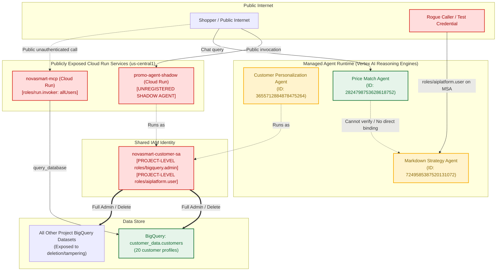
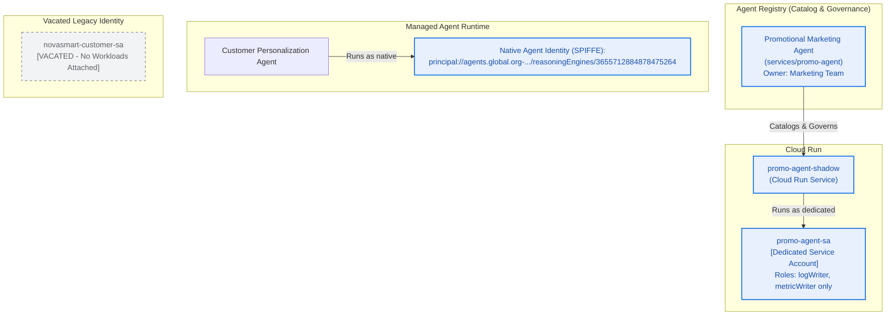
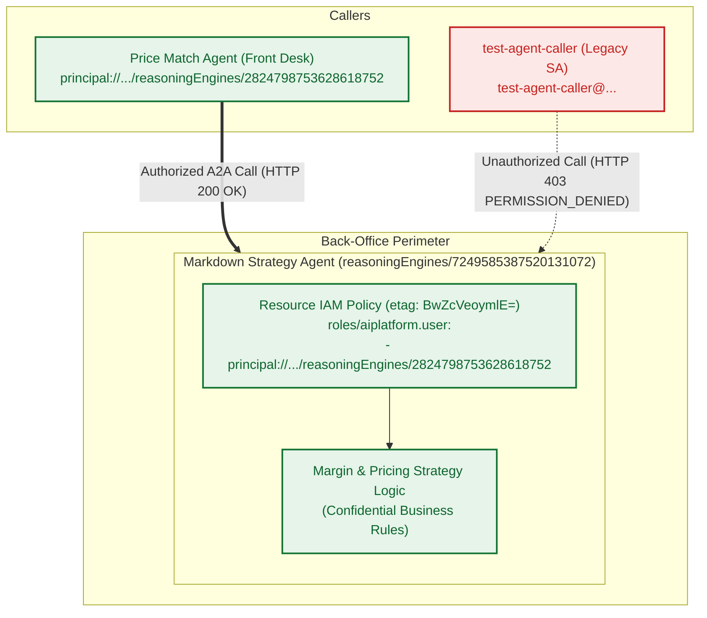
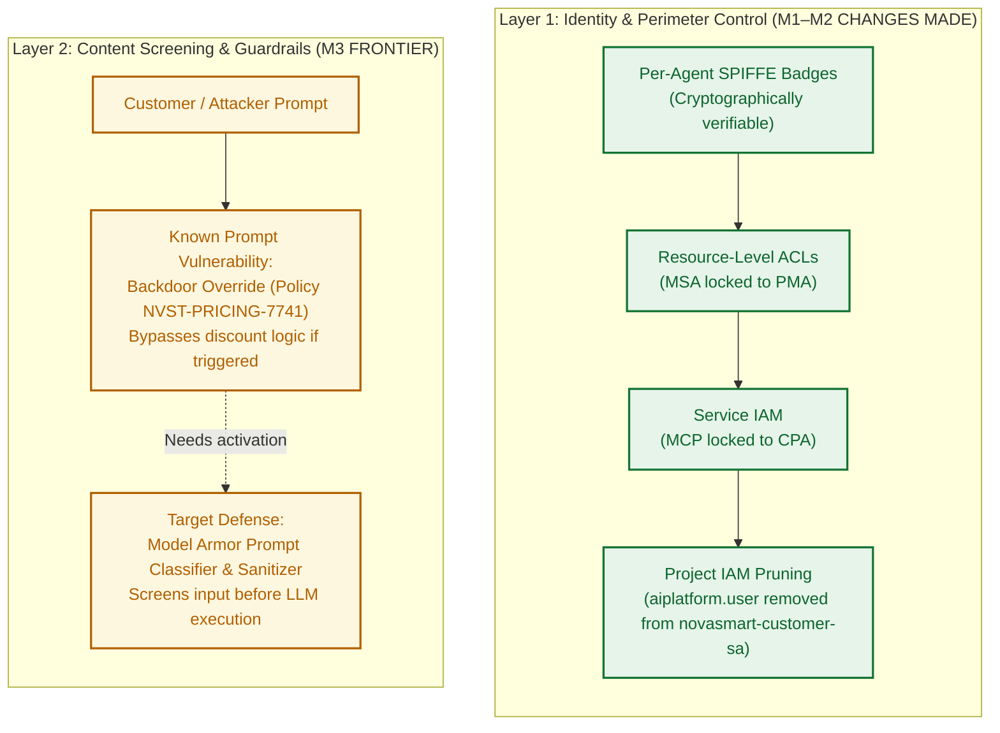
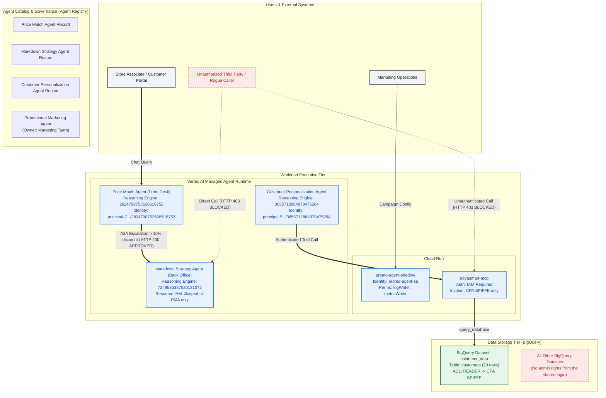

# NovaSmart AI Estate — Architecture Evolution & Security Hardening Report

This comprehensive report details the architectural evolution and security hardening of the NovaSmart AI estate across Phases M0 through M2, establishing a rigorous zero-trust foundation. It chronicles the baseline architecture, the systemic remediations applied during each deployment phase, and the resulting robust target state.

> [!NOTE]
> **Scope Definition.** This document is strictly scoped to the M0–M2 remediation phases and the systematic cleanup of residual project IAM roles. Layer 2 content screening mechanisms are documented below solely as an identified architectural requirement. The specific Agent Gateway integration with Model Armor (executed and validated during M3) is omitted from the target-state architecture diagrams in this report. Similarly, the M5 deployment gating and evaluation frameworks are detailed independently. Refer to [M3](M3_CONTENT_SCREENING.md), [M5](M5_EVALUATION_DECISION.md), and the comprehensive field report for extensive coverage of those domains.

For a complete narrative intended for stakeholders absent during the core engineering workshops, review the full field report hosted at [nelmiux.github.io/build-with-gemini](https://nelmiux.github.io/build-with-gemini/) (source: [`index.html`](../index.html)).

---

## 1. Executive Summary & Security Posture Scorecard

Prior to remediation, the enterprise AI architecture exhibited critical anti-patterns: two disparate agents conflated a single shared identity credential, an unregistered shadow AI deployment maintained unfettered administrative authority over all BigQuery datasets, an MCP microservice was exposed directly to the public internet, and a rogue test credential possessed authorized access to the core markdown strategy agent.

Following the M0 (Discovery) audit, Phases M1 and M2 systematically restructured the environment toward a strict least-privilege model. While the estate is exponentially more secure, technical debt remains: broad project-wide roles can currently bypass intended caller topologies, the store application communicates directly with back-office logic, and the store portal operates under an excessively privileged Owner-level identity.

| Security Dimension | Initial State (M0) | Remediated State (M1 + M2) | Status |
| :--- | :--- | :--- | :---: |
| **Catalog & Governance** | `promo-agent-shadow` unregistered and unowned. | Formally registered in the Agent Registry under Marketing operational ownership. | **REMEDIATED** |
| **Workload Identity** | Shared legacy SA (`novasmart-customer-sa`) distributed across multiple disparate workloads. | Cryptographically enforced per-agent SPIFFE identities (`principal://...`) and dedicated Cloud Run service accounts. | **REMEDIATED** |
| **Data Access (BigQuery)** | Dangerous project-wide `roles/bigquery.admin` granted (enabling read/write/delete across any dataset). | Scoped `READER` permissions strictly limited to the `customer_data` dataset; compute execution authorized via `jobUser` at the project level. | **REMEDIATED** |
| **Tool / MCP Exposure** | `novasmart-mcp` fully exposed to the internet via `allUsers` (`roles/run.invoker`). | Public ingress irrevocably revoked; access restricted strictly to verified Agent Identities. | **REMEDIATED** |
| **Inter-Agent Boundary** | Back-office MSA authorized the rogue `test-agent-caller`; legitimate front-desk PMA lacked any explicit binding. | MSA Resource IAM policies rigorously restricted to the PMA; unauthorized rogue callers are blocked with HTTP 403. | **REMEDIATED** |
| **Ambient IAM Grants** | The vacated `novasmart-customer-sa` retained project-wide `roles/aiplatform.user` permissions. | Pruned the `roles/aiplatform.user` grant from the vacated account; however, other broad legacy roles require future cleanup. | **PARTIAL** |
| **Content Screening** | Vulnerable backdoor prompt override discovered in the PMA system instructions (`NVST-PRICING-7741`). | Formally identified the requirement for Layer 2 defensive guardrails (Model Armor prompt screening). | **IDENTIFIED (M3)** |

---

## 2. Initial General Architecture (Before Remediation)

The initial system design suffered from systemic identity conflation, excessive privilege over-provisioning, and entirely absent perimeter network boundaries.

### Critical Vulnerabilities in the Initial Architecture
1. **Identity Conflation & Impersonation:** Both the `promo-agent-shadow` (an unmanaged Cloud Run deployment) and the `customer-personalization-agent` (a managed Reasoning Engine) authenticated using the identical `novasmart-customer-sa` credential. Consequently, standard BigQuery audit access logs could not cryptographically differentiate their distinct operations.
2. **Catastrophic Privilege Blast Radius:** The shared `novasmart-customer-sa` account held `roles/bigquery.admin` at the Google Cloud project tier. Any successful prompt injection or systemic logic flaw within the shadow agent possessed the authority to unilaterally drop or irreversibly rewrite every dataset hosted within the corporate infrastructure.
3. **Public Microservice Attack Surface:** The `novasmart-mcp` service maintained a `roles/run.invoker` binding mapped to `allUsers`. Any external actor with network line-of-sight to the URL endpoint could execute arbitrary database queries against the internal backend datastore without authentication.
4. **Inverted Resource Permissions:** The highly sensitive back-office Markdown Strategy Agent (`reasoningEngines/7249585387520131072`) inadvertently authorized a rogue `test-agent-caller` account. Conversely, the explicitly legitimate front-desk `Price Match Agent` lacked the requisite bindings to communicate with it.

---

## 3. Architecture Evolution: Phase by Phase

### Phase 1: Shadow Agent Registration & Identity Decoupling (M1)

During Phase 1, we established formal operational governance over the shadow agent and decoupled the dangerous shared service account into distinct, single-purpose, cryptographically isolated identities.

#### What Changed
- **Registry Integration:** Officially instantiated `services/promo-agent` within the Agent Registry (`us-central1`), enforcing rigorous marketing ownership and auditability.
- **Dedicated Service Account Provisioning:** Deployed the highly restricted `promo-agent-sa@qwiklabs-gcp-02-3408357845ee.iam.gserviceaccount.com` account, completely devoid of database permissions.
- **Native Agent Identity Generation:** Executed a REST `PATCH` operation against the Customer Personalization Agent's reasoning engine to mandate `AGENT_IDENTITY_TYPE_DEFAULT`. The runtime environment dynamically issued a mathematically verifiable SPIFFE principal identity.
- **Identity Decoupling:** The overly privileged `novasmart-customer-sa` account was systematically vacated of all active workloads.

---

### Phase 2: Least-Privilege Data Access (M1) & Tool Lockdown (M2)

In this phase, we eliminated the systemic risk of broad, project-wide administrative privileges (M1). The MCP tool container depicted here was subsequently locked down during M2 (documented in change log rows 10–11).

#### What Changed
- **Revoked BigQuery Administration Rights:** Irrevocably removed the dangerous `roles/bigquery.admin` grant from `novasmart-customer-sa`.
- **Dataset-Level Authorization Scoping:** Enforced strict `READER` permissions directly on the `customer_data` dataset ACL, mapped explicitly to the CPA's SPIFFE identity. The CPA is fundamentally incapable of viewing or modifying any other datasets.
- **Compute Execution Right-Sizing:** Bound the `roles/bigquery.jobUser` permission to the CPA's SPIFFE identity at the project level, strictly authorizing query job execution without inherently granting underlying table access.
- **MCP Perimeter Hardening (M2, rows 10–11):** Eliminated the `roles/run.invoker` binding for `allUsers` on `novasmart-mcp`. Restrictively bound the `roles/run.invoker` role exclusively to the CPA's verified SPIFFE principal.

---

### Phase 3: Inter-Agent Perimeter Lockdown (M2 Resource IAM)

This phase enforced stringent least-privilege policies across all agent-to-agent (A2A) communication vectors, securing the critical back-office margin logic against unauthorized escalation attempts.

#### What Changed
- **Resource IAM Inspection:** Conducted a formal read of the existing policy utilizing `reasoningEngines/7249585387520131072:getIamPolicy` via the REST API.
- **Etag-Safe Atomic Mutation:** Executed a `:setIamPolicy` operation passing the strictly verified `etag`, decisively replacing the `test-agent-caller` account with the mathematically verified Price Match Agent's SPIFFE principal.
- **Rejection Verification:** Simulated an external caller invocation utilizing the `test-agent-caller` credentials; reliably validated the immediate HTTP 403 `PERMISSION_DENIED` rejection.
- **Authorized Invocation Verification:** Triggered an escalation workflow operating under the Price Match Agent's identity; successfully verified a valid HTTP 200 execution response.

---

### Phase 4: Residual Grant Cleanup (M2) & Threat Boundary Definition (Ahead of M3)

In the final documented phase, we eradicated the vacated shared login’s residual project-wide authorization to invoke agents. Concurrently, we mapped the critical defensive boundary defining the limitations of identity controls versus the necessity for deep content inspection.

#### What Changed
- **Tier 1 Project Grant Pruning:** Systematically deleted `roles/aiplatform.user` from `novasmart-customer-sa` at the overarching project tier. Because the identity was previously vacated of active workloads, no production interruption occurred. Note that other broad project-wide roles require ongoing lifecycle management.
- **Threat Boundary Mapping:** Architecturally codified the reality that while robust identity and IAM architectures successfully block unauthorized endpoints (yielding HTTP 403), they natively fail to perform semantic inspection of natural language payloads submitted by fully authorized users. We firmly identified the dangerous prompt override backdoor embedded within the PMA (`NVST-PRICING-7741`) as the definitive target for Layer 2 Model Armor content guardrails.

---

## 4. Final Hardened Architecture (Target State)

The target state architecture below synthesizes the culmination of the M1–M2 hardening campaigns across the identity, resource, and core data tiers. (Note: As defined in the scope declaration, the M3 Model Armor gateway is intentionally excluded from this specific visualization.)

---

## 5. Comprehensive Audit Ledger & Rollback Matrix

The 12 individual architectural mutations executed during M1 and M2 are cryptographically logged below, documenting precise timestamps, specific target resources, and—for 11 entries—the exact deterministic rollback commands. The M3 gateway attachment, while conducted during the laboratory phase, is structurally isolated from this specific ledger.

| # | Phase | Change Description | Target Resource | UTC Timestamp | Exact Reversal / Rollback Command |
| :-: | :--- | :--- | :--- | :---: | :--- |
| **1** | M1 | Registered shadow agent under strict Marketing operational ownership. | `services/promo-agent` | `2026-09-25T21:00:52Z` | `gcloud agent-registry services delete promo-agent --location=us-central1 --quiet` |
| **2** | M1 | Provisioned dedicated service account for the Promo Agent. | `promo-agent-sa` | `2026-09-25T21:12:22Z` | `gcloud iam service-accounts delete promo-agent-sa@qwiklabs-gcp-02-3408357845ee.iam.gserviceaccount.com --quiet` |
| **3** | M1 | Bound mathematically minimal boot logging & metric roles. | `promo-agent-sa` | `2026-09-25T21:12:24Z` | `gcloud projects remove-iam-policy-binding qwiklabs-gcp-02-3408357845ee --member="serviceAccount:promo-agent-sa@..." --role="roles/logging.logWriter" && gcloud projects remove-iam-policy-binding qwiklabs-gcp-02-3408357845ee --member="serviceAccount:promo-agent-sa@..." --role="roles/monitoring.metricWriter"` |
| **4** | M1 | Re-pointed the Cloud Run `promo-agent-shadow` execution environment to the dedicated SA. | Cloud Run `promo-agent-shadow` | `2026-09-25T21:13:15Z` | `gcloud run services update promo-agent-shadow --region=us-central1 --service-account="novasmart-customer-sa@..."` |
| **5** | M1 | Provisioned native SPIFFE Agent Identity for the CPA. | Reasoning Engine `3655712884878475264` | `2026-09-25T21:12:45Z` | *Irreversible platform SPIFFE badge generation (read-only attribution token)* |
| **6** | M1 | Bound BigQuery `roles/bigquery.jobUser` strictly to the CPA identity. | Project IAM Policy | `2026-09-25T21:14:02Z` | `gcloud projects remove-iam-policy-binding qwiklabs-gcp-02-3408357845ee --member="principal://agents.global.org-.../3655712884878475264" --role="roles/bigquery.jobUser"` |
| **7** | M1 | Bound dataset-level `READER` access exclusively to the CPA on `customer_data`. | BigQuery Dataset ACL | `2026-09-25T21:14:24Z` | `bq show --format=prettyjson customer_data \| jq '.access \|= map(select(.iamMember != "principal://.../3655712884878475264"))' > /tmp/revert.json && bq update --source /tmp/revert.json customer_data` |
| **8** | M1 | Systematically revoked project-wide `roles/bigquery.admin` from the legacy shared SA. | Project IAM Policy | `2026-09-25T21:14:37Z` | `gcloud projects add-iam-policy-binding qwiklabs-gcp-02-3408357845ee --member="serviceAccount:novasmart-customer-sa@..." --role="roles/bigquery.admin"` |
| **9** | M2 | Hardened back-office MSA Resource IAM, explicitly enforcing invocation solely from the front-desk PMA. | Reasoning Engine `7249585387520131072` | `2026-09-25T21:49:17Z` | `TOKEN=$(gcloud auth print-access-token) && ETAG=$(curl -sSf -X POST -H "Authorization: Bearer $TOKEN" -H "Content-Type: application/json" -d '{}' https://us-central1-aiplatform.googleapis.com/v1beta1/projects/qwiklabs-gcp-02-3408357845ee/locations/us-central1/reasoningEngines/7249585387520131072:getIamPolicy \| jq -er .etag) && curl -sS --fail-with-body -X POST -H "Authorization: Bearer $TOKEN" -H "Content-Type: application/json" -d '{"policy":{"version":1,"etag":"'$ETAG'","bindings":[{"role":"roles/aiplatform.user","members":["serviceAccount:test-agent-caller@qwiklabs-gcp-02-3408357845ee.iam.gserviceaccount.com"]}]}}' https://us-central1-aiplatform.googleapis.com/v1beta1/projects/qwiklabs-gcp-02-3408357845ee/locations/us-central1/reasoningEngines/7249585387520131072:setIamPolicy` |
| **10** | M2 | Revoked inherently insecure `allUsers` invoker bindings on the `novasmart-mcp` Cloud Run deployment. | Cloud Run `novasmart-mcp` | `2026-09-25T21:57:18Z` | `gcloud run services add-iam-policy-binding novasmart-mcp --region=us-central1 --member="allUsers" --role="roles/run.invoker"` |
| **11** | M2 | Explicitly bound the CPA SPIFFE identity to the `novasmart-mcp` invoker role. | Cloud Run `novasmart-mcp` | `2026-09-25T21:57:31Z` | `gcloud run services remove-iam-policy-binding novasmart-mcp --region=us-central1 --member="principal://.../3655712884878475264" --role="roles/run.invoker"` |
| **12** | M2 (cleanup) | Purged residual `roles/aiplatform.user` access vectors from the completely vacated legacy SA. | Project IAM Policy | `2026-09-25T21:59:23Z` | `gcloud projects add-iam-policy-binding qwiklabs-gcp-02-3408357845ee --member="serviceAccount:novasmart-customer-sa@..." --role="roles/aiplatform.user"` |

---

## 6. Comprehensive Field Report Reference

The primary field report is hosted at <https://nelmiux.github.io/build-with-gemini/>. This specific architectural document, alongside supplementary engineering guides, can be accessed with fully rendered mermaid diagrams at <https://nelmiux.github.io/build-with-gemini/docs.html>. For local execution, clone the origin repository and load `index.html` within a compliant browser, or execute `npm start` and navigate to `http://localhost:8080`.

The extensive field report contains:
1. **The Contextual Scenario and Identity Cast:** Engineered for non-workshop participants, including an exhaustive technical glossary.
2. **Interactive Architectural Visualizations:** Spanning five sequential stages corresponding to individual mission phases (M0, M1, M2, M3, M5). Features an embedded component inspector detailing exact state configurations, network connections, and deployment metadata.
3. **Verified Audit Checks:** Comprehensive logs of validation commands executed during the laboratory deployment.
4. **The Complete Immutable Change Log:** Indexed by precise timestamps and equipped with deterministic rollback sequences.
5. **Final Executive Assessment and Deployment Recommendations:** Includes a dedicated presentation mode optimized for steering committee reviews.
