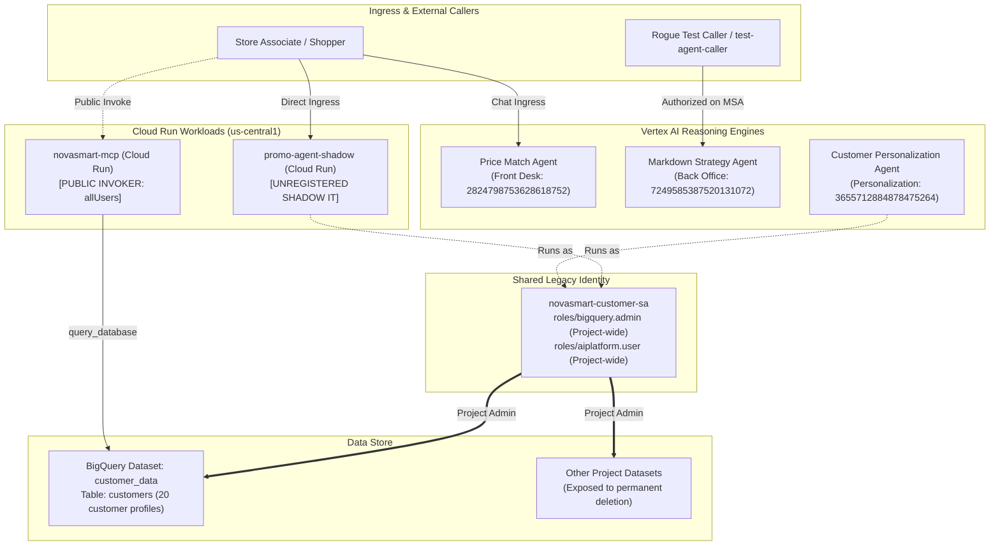

# M0: See Everything — Discovery & Baseline Architecture

## Overview
During the initial discovery phase (Module 0), we conducted a comprehensive architectural audit of the AI agent estate for the retail enterprise **NovaSmart**, deployed within Google Cloud project `qwiklabs-gcp-02-3408357845ee`.

The primary objective was to establish complete situational awareness of all running workloads, service identities, IAM permissions, and network exposure surfaces prior to executing any remediation strategies. This zero-trust baseline is critical for secure multi-agent governance.

---

## Initial Architecture Diagram



---

## Critical Baseline Findings

| # | Component | Observed Vulnerability | Impact / Risk |
|---|---|---|---|
| **1** | `promo-agent-shadow` | Unregistered Cloud Run microservice operating outside the official catalog. | **Shadow IT Risk**: Bypasses governance and compliance protocols, creating an ownership blind spot. |
| **2** | `novasmart-customer-sa` | Shared service account utilized concurrently by `promo-agent-shadow` and `Customer Personalization Agent`. | **Identity Conflation**: Forensic audit logs cannot distinguish marketing workloads from customer-facing queries. |
| **3** | `novasmart-customer-sa` | Broadly bound to `roles/bigquery.admin` across the entire Google Cloud project. | **Catastrophic Blast Radius**: A prompt injection payload or logic flaw could permanently drop or maliciously alter all datasets within the project. |
| **4** | `novasmart-mcp` | Cloud Run service exposing a `query_database` tool bound to `roles/run.invoker: allUsers`. | **Public Exposure**: Anonymous HTTP requests originating from any external source can query internal databases without authentication. |
| **5** | `Markdown Strategy Agent` | Resource IAM policy authorized an orphaned service account (`test-agent-caller`) while lacking an explicit binding for the `Price Match Agent`. | **Inverted Access Control**: Unapproved test accounts maintain access to confidential margin data, whereas legitimate front-desk agent escalations are blocked. |

---

## Verification Commands Executed During M0
```bash
# 1. Discover Cloud Run services
gcloud run services list --project=qwiklabs-gcp-02-3408357845ee --region=us-central1

# 2. Inspect Reasoning Engines
curl -s -H "Authorization: Bearer $(gcloud auth print-access-token)" \
  https://us-central1-aiplatform.googleapis.com/v1/projects/qwiklabs-gcp-02-3408357845ee/locations/us-central1/reasoningEngines

# 3. Check IAM Bindings of Shared Service Account
gcloud projects get-iam-policy qwiklabs-gcp-02-3408357845ee \
  --flatten="bindings[].members" \
  --filter="bindings.members:novasmart-customer-sa"
```
