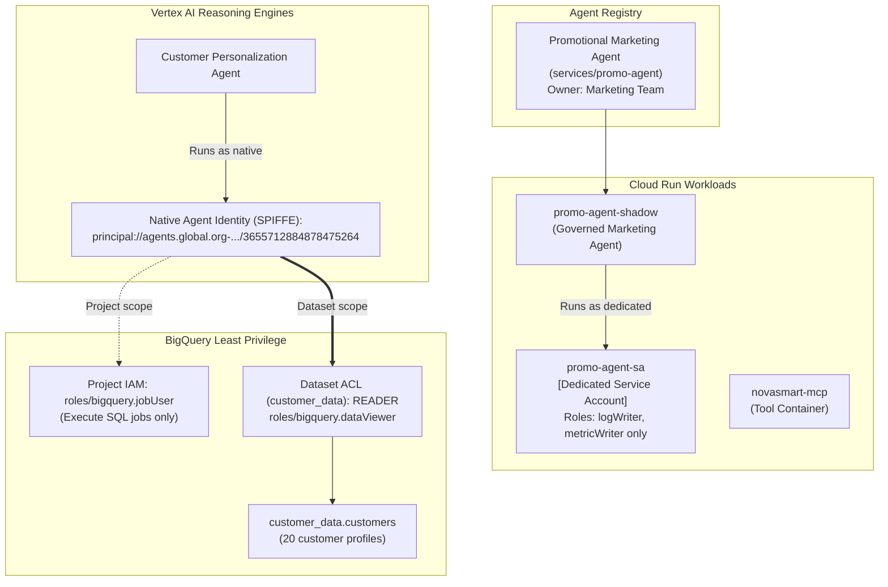

# M1: Take Action — Identity Decoupling & Least Privilege

## Overview
In Module 1, we tackled the foundational architectural flaw: **shared identities** and **excessive project-level permissions**.

We decoupled the shadow IT marketing workload from the customer personalization agent, created dedicated service accounts, provisioned native Google Cloud Agent Identities (SPIFFE badges), and enforced dataset-level least privilege on BigQuery.

---

## Architecture Diagram (Post-M1)



---

## Remediations Executed

### 1. Cataloging Shadow IT in Agent Registry
- Registered `promo-agent-shadow` in Google Cloud Agent Registry as `services/promo-agent` with explicit marketing ownership.
- Command:
  ```bash
  gcloud agent-registry services create promo-agent     --location=us-central1     --display-name="Promotional Marketing Agent"     --description="Generates personalized discount codes for seasonal campaigns"
  ```

### 2. Dedicated Workload Identity Provisioning
- Created dedicated service account `promo-agent-sa@qwiklabs-gcp-02-3408357845ee.iam.gserviceaccount.com`.
- Bound only telemetry roles (`roles/logging.logWriter` and `roles/monitoring.metricWriter`).
- Re-pointed Cloud Run `promo-agent-shadow` to use `promo-agent-sa`, completely severing its access to internal customer databases.

### 3. Native Cryptographic Agent Identity (SPIFFE)
- Generated native Agent Identity for Customer Personalization Agent:
  `principal://agents.global.org-616463121992.system.id.goog/resources/aiplatform/projects/82075562614/locations/us-central1/reasoningEngines/3655712884878475264`
- Ensured non-repudiable audit logging for all database queries executed by this agent.

### 4. BigQuery Least-Privilege Scoping
- Stripped project-wide `roles/bigquery.admin` from `novasmart-customer-sa`.
- Granted project-level `roles/bigquery.jobUser` strictly to allow query execution.
- Bound `READER` role directly on the `customer_data` dataset ACL for the CPA SPIFFE principal.
