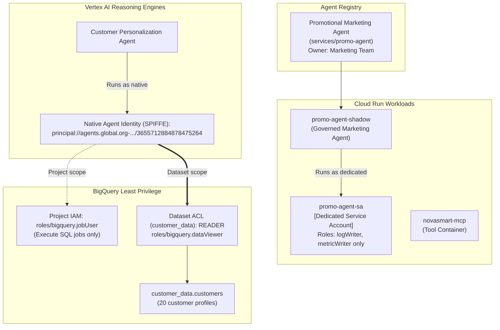

# M1: Take Action — Identity Decoupling & Least Privilege

## Overview
In Module 1, we remediated a foundational architectural anti-pattern: **shared service identities** and **excessive project-level IAM permissions**.

To establish a zero-trust execution environment, we decoupled the shadow IT marketing workload from the Customer Personalization Agent, created dedicated service accounts, provisioned native Google Cloud Agent Identities (SPIFFE badges), and enforced strict dataset-level least privilege on BigQuery.

---

## Architecture Diagram (Post-M1)



---

## Remediations Executed

### 1. Cataloging Shadow IT in Agent Registry
- Registered the previously unmanaged `promo-agent-shadow` within the Google Cloud Agent Registry as `services/promo-agent`, enforcing explicit operational ownership by the Marketing Team.
- Execution Command:
  ```bash
  gcloud agent-registry services create promo-agent \
    --location=us-central1 \
    --display-name="Promotional Marketing Agent" \
    --description="Generates personalized discount codes for seasonal campaigns"
  ```

### 2. Dedicated Workload Identity Provisioning
- Provisioned a strictly scoped service account: `promo-agent-sa@qwiklabs-gcp-02-3408357845ee.iam.gserviceaccount.com`.
- Bound only essential observability roles (`roles/logging.logWriter` and `roles/monitoring.metricWriter`).
- Reconfigured the Cloud Run `promo-agent-shadow` service to execute as `promo-agent-sa`, irrevocably severing its previous access vectors to internal customer databases.

### 3. Native Cryptographic Agent Identity (SPIFFE)
- Generated a native, non-repudiable Agent Identity for the Customer Personalization Agent:
  `principal://agents.global.org-616463121992.system.id.goog/resources/aiplatform/projects/82075562614/locations/us-central1/reasoningEngines/3655712884878475264`
- This ensures high-fidelity audit logging for all downstream database queries executed by this specific agent.

### 4. BigQuery Least-Privilege Scoping
- Systematically stripped the dangerous project-wide `roles/bigquery.admin` grant from `novasmart-customer-sa`.
- Granted the project-level `roles/bigquery.jobUser` role strictly to facilitate compute execution for SQL jobs.
- Implemented a scoped `READER` role directly via the `customer_data` dataset ACL, targeting the CPA's SPIFFE principal exclusively.
