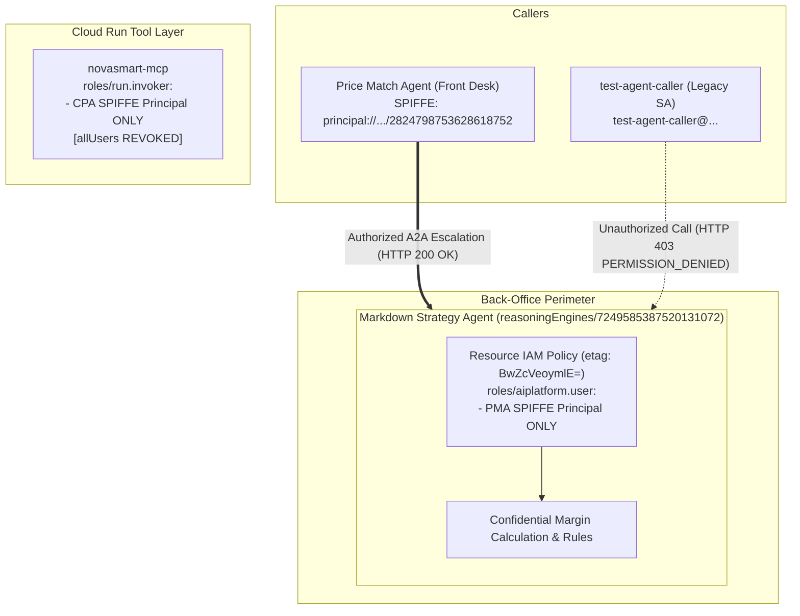

# M2: Control the Connections — Inter-Agent Boundary & Resource IAM

## Overview
Module 2 focuses on establishing rigorous **inter-agent access control** and securing **tool microservice perimeters**.

In distributed multi-agent architectures, sensitive "back-office" agents (e.g., those managing pricing, margin strategies, or financial transactions) must operate within a strict zero-trust boundary. They must only process invocations from explicitly authorized front-desk agents, systematically rejecting direct access from external users or orphaned test credentials.

---

## Architecture Diagram (Post-M2)



---

## Key Remediations & Technical Mechanics

### 1. Vertex AI Reasoning Engine Resource IAM
Unlike standard Google Cloud resources, Vertex AI Reasoning Engines do not natively support the `gcloud ai reasoning-engines set-iam-policy` command wrapper. Consequently, access control modifications must be executed via direct REST API calls, ensuring strict `etag` concurrency management to prevent race conditions:

```bash
# 1. Fetch current policy and etag
TOKEN=$(gcloud auth print-access-token)
curl -s -H "Authorization: Bearer $TOKEN" \
  https://us-central1-aiplatform.googleapis.com/v1/projects/82075562614/locations/us-central1/reasoningEngines/7249585387520131072:getIamPolicy > /tmp/msa_iam.json

# 2. Update policy: Evict test-agent-caller and strictly bind the PMA SPIFFE principal
cat << 'EOF' > /tmp/updated_msa_iam.json
{
  "policy": {
    "bindings": [
      {
        "role": "roles/aiplatform.user",
        "members": [
          "principal://agents.global.org-616463121992.system.id.goog/resources/aiplatform/projects/82075562614/locations/us-central1/reasoningEngines/2824798753628618752"
        ]
      }
    ],
    "etag": "BwZcVeoymlE="
  }
}
EOF

# 3. Apply policy atomically
curl -s -X POST -H "Authorization: Bearer $TOKEN" \
  -H "Content-Type: application/json" \
  -d @/tmp/updated_msa_iam.json \
  https://us-central1-aiplatform.googleapis.com/v1/projects/82075562614/locations/us-central1/reasoningEngines/7249585387520131072:setIamPolicy
```

### 2. Live Verification Results
1. **Rogue Caller Rejection**: An attempted invocation by the `test-agent-caller` account was successfully blocked, returning:
   ```json
   {
     "error": {
       "code": 403,
       "message": "Permission 'aiplatform.reasoningEngines.query' denied on resource 'reasoningEngines/7249585387520131072'",
       "status": "PERMISSION_DENIED"
     }
   }
   ```
2. **Legitimate A2A Escalation**: When the Price Match Agent escalated discount requests exceeding 10%, the Markdown Strategy Agent correctly validated the SPIFFE identity, responded with `HTTP 200 OK`, and securely authorized the markdown logic.
3. **MCP Microservice Lockdown**: The broad `roles/run.invoker: allUsers` binding was revoked from `novasmart-mcp` and restrictively bound exclusively to the Customer Personalization Agent's SPIFFE badge. All anonymous HTTP requests are now reliably dropped with `HTTP 403 Forbidden`.
